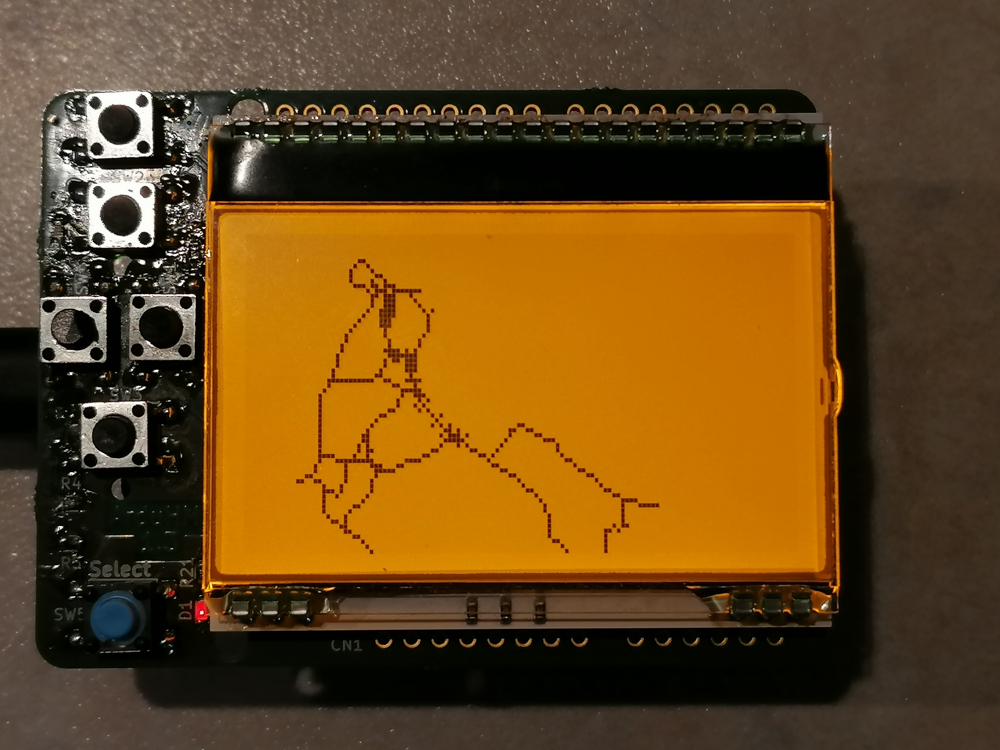

# NavigationOnArduino

Manage navigaiton tasks with geodata (latitude and  longitude) and openstreetmap on an Arduino.

## Features

* distance and bearing calculation between waypoints
* course heading calculation
* offtrack check
* simple and lightweight openstreetmap file parser (.osm)
* management of waypoints in map
* route planning with Dijkstra's algorithm
